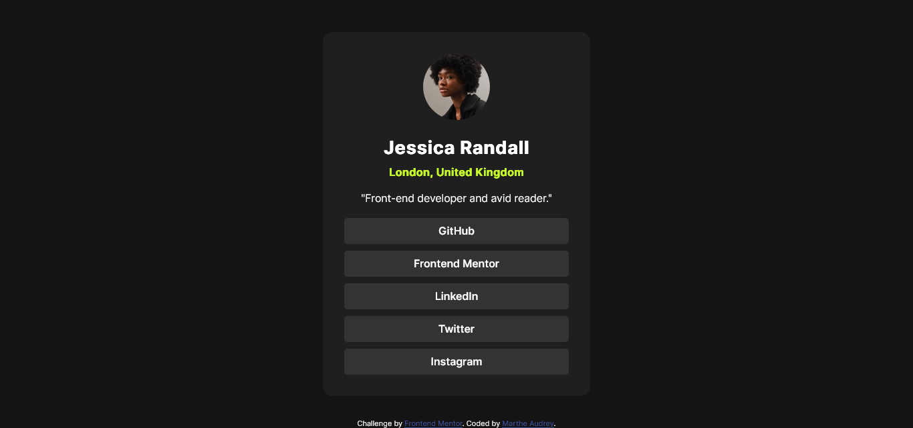

# Frontend Mentor - Social links profile solution

This is a solution to the [Social links profile challenge on Frontend Mentor](https://www.frontendmentor.io/challenges/social-links-profile-UG32l9m6dQ). Frontend Mentor challenges help you improve your coding skills by building realistic projects. 

## Table of contents

- [Overview](#overview)
  - [The challenge](#the-challenge)
  - [Screenshot](#screenshot)
  - [Links](#links)
- [My process](#my-process)
  - [Built with](#built-with)
  - [What I learned](#what-i-learned)
  - [Continued development](#continued-development)
  - [Useful resources](#useful-resources)
- [Author](#author)

**Note: Delete this note and update the table of contents based on what sections you keep.**

## Overview

### The challenge

Users should be able to:

- See hover and focus states for all interactive elements on the page

### Screenshot



### Links

- Solution URL: [Add solution URL here](https://your-solution-url.com)
- Live Site URL: [Add live site URL here](https://your-live-site-url.com)

## My process

1. Understand the challenge
2. Build the HTML structure
3. Style everything with CSS

### Built with

- Semantic HTML5 markup
- CSS custom properties

### What I learned

While building this project I learned to make the width of a container responsive without using media queries.

This is my code snippets, see below:

```css
.container{
    background-color: var(--grey-800);
    max-height: 90%;
    width: min(80%, 400px);
    color: hsl(0, 0%, 100%);
    padding: 2rem;
    text-align: center;
    border-radius: 15px;
    position:absolute;
    top: 50%;
    left: 50%;
    transform: translate(-50%, -50%);
}
```

### Continued development

I would like to learn more methods on how to make a website responsive without using media queries and discover nex CSS properties.

### Useful resources

- [Code With Hooria - Stop Using Media Queries! Try This Instead](https://www.youtube.com/watch?v=K7m13jOby5Q) - This helped me for XYZ reason. I really liked this pattern and will use it going forward.
- [Min-Max-Value Interpolation](min-max-calculator.9elements.com) - This is an amazing article which helped me finally understand XYZ. I'd recommend it to anyone still learning this concept.

## Author
- Frontend Mentor - [@MartheAudrey](https://www.frontendmentor.io/profile/MartheAudrey)

